# 🌡️ ESP32 Real-Time Temperature Monitoring System
<sub>Dual Sensor Fusion with Kalman Filter, OLED Display, FreeRTOS & Actuator Control</sub>

<p align="center">
  
</p>

<p align="center">
  <em>Sistem monitoring suhu real-time berbasis ESP32 dengan dual sensor fusion (DHT22 + NTC Thermistor), filter Kalman 1D untuk stabilisasi data, tampilan OLED I2C 128x64, kontrol aktuator (Buzzer + Motor Stepper), dan multitasking FreeRTOS dengan mutex protection untuk aplikasi industri maupun IoT hobby.</em>
</p>

<p align="center">
  
  
  
  
  
  
  
  <a href="https://github.com/your-username/esp32-temperature-monitor/blob/main/LICENSE">
    
  </a>
</p>

---

## 📋 Daftar Isi
- [Desain Lengkap](#-desain-lengkap)
  - [Desain Hardware](#-desain-hardware)
  - [Desain Software](#-desain-software)
- [Penjelasan Program](#-penjelasan-program)
  - [Arsitektur FreeRTOS](#-arsitektur-freertos)
  - [Sensor Fusion & Kalman Filter](#-sensor-fusion--kalman-filter)
  - [Kontrol Aktuator](#-kontrol-aktuator)
- [📊 Data Flow Diagram](#-data-flow-diagram)
- [Instalasi](#-instalasi)
- [Cara Menjalankan](#-cara-menjalankan)
- [Testing & Validasi](#-testing--validasi)
- [Troubleshooting](#-troubleshooting)
- [Struktur Folder](#-struktur-folder)
- [Kontribusi](#-kontribusi)
- [Pengembang](#-pengembang)
- [Lisensi](#-lisensi)

---

## 📐 Desain Lengkap

### Desain Hardware
Sistem ini dirancang untuk aplikasi monitoring suhu industrial atau hobby IoT dengan akurasi tinggi, responsivitas cepat, dan kontrol aktuator otomatis berbasis threshold suhu 25°C. Fokus pada redundansi sensor (dual) untuk keandalan, serta konsumsi daya rendah (~50mA active).

#### Komponen Utama
| Komponen | Fungsi | Spesifikasi | Keterangan |
|----------|--------|-------------|------------|
| **ESP32 (DevKit v1)** | Mikrokontroler utama | 240MHz Dual-core, 520KB SRAM, Built-in WiFi/BLE | Handle FreeRTOS multitasking, threading safety dengan mutex |
| **DHT22** | Sensor suhu & kelembapan | GPIO 4, 1-wire, Akurasi ±0.5°C | Primary sensor untuk pembacaan suhu presisi |
| **NTC Thermistor** | Sensor suhu backup | GPIO 34 (ADC), 10kΩ @ 25°C, β=3950 | Secondary sensor; combined via averaging + Kalman Filter |
| **SSD1306 OLED 128x64** | Display output | I2C (GPIO 21 SDA, GPIO 22 SCL), 3.3V | Real-time temperature display dengan update 500ms |
| **Buzzer Aktif** | Audio alarm | GPIO 15, 5V logic (aktif HIGH) | Trigger saat suhu > 25°C |
| **Motor Stepper 28BYJ-48** | Mechanical actuator | GPIO 13,12,14,27 (ULN2003 driver), 5V | Gerak CW/CCW saat suhu tinggi untuk cooling simulation |
| **Resistor Divider** | ADC voltage scaling | 10kΩ + 10kΩ untuk NTC | Safe ADC input 0-3.3V, 12-bit resolution |

#### Diagram Blok Hardware

```mermaid
graph TD
    A["⚡ ESP32<br/>GPIO 4: DHT22<br/>GPIO 34: NTC ADC<br/>GPIO 21/22: I2C<br/>GPIO 15: Buzzer<br/>GPIO 13,12,14,27: Stepper"] -->|1-wire| B["🌡️ DHT22<br/>Temp + Humidity"]
    A -->|ADC| C["🌡️ NTC Thermistor<br/>Dual redundancy"]
    A -->|I2C| D["📺 OLED SSD1306<br/>128x64 Display"]
    A -->|GPIO 15| E["🔊 Buzzer Aktif<br/>Alert saat T > 25°C"]
    A -->|GPIO 13,12,14,27| F["⚙️ Stepper 28BYJ-48<br/>CW/CCW Motion"]
    B & C -->|Sensor Data| G["📊 Sensor Fusion<br/>Average Valid Readings"]
    G -->|Kalman Filter| H["🎯 Filtered Data<br/>Noise Reduction"]
    H -->|Update Display| D
    H -->|Threshold Check| I{" > 25°C ?"}
    I -->|YES| J["🟢 Actuator ON<br/>Buzzer: HIGH<br/>Stepper: Rotate"]
    I -->|NO| K["🔴 Actuator OFF<br/>Buzzer: LOW<br/>Stepper: Stop"]
    style A fill:#bbf,stroke:#333,stroke-width:2px
    style D fill:#ff9,stroke:#333,stroke-width:2px
    style H fill:#9f9,stroke:#333,stroke-width:2px
    style I fill:#f99,stroke:#333,stroke-width:2px
```


## 📸 Demo Singkat
> Sistem monitoring suhu ESP32 dengan dual sensor (DHT22 + NTC), filter Kalman untuk data halus, tampilan OLED real-time, dan aktuator otomatis: Buzzer berbunyi + stepper berputar saat suhu >25°C. Update serial menampilkan raw/filtered data. Threshold crossing trigger cooling simulation.
> - **Normal Mode:** Suhu 23°C, display "NORMAL", aktuator off.
> - **Alert Mode:** Suhu 26°C, "COOLING ACTIVE", buzzer ON + stepper rotate CW/CCW.
> - **Failure Handling:** Jika sensor gagal, gunakan nilai terakhir.

<p align="center">
  <br/>
  <em>Demo Real-Time Monitoring, Threshold Alert, & Actuator Response</em>
</p>

#### Wiring Diagram Detail
<p align="center">
  <br/>
  <em>Diagram Pengkabelan Lengkap: Sensor, Display, Aktuator</em><br/>
  <strong>⚙️ Pin Configuration:</strong><br/>
  🔹 <strong>DHT22</strong>: Data → GPIO 4 (dengan pull-up 4.7kΩ)<br/>
  🔹 <strong>NTC Thermistor</strong>: ADC0 → GPIO 34 (dengan voltage divider 10k+10k, 12-bit resolution)<br/>
  🔹 <strong>OLED I2C</strong>: SDA → GPIO 21, SCL → GPIO 22 (I2C address 0x3C, 400kHz)<br/>
  🔹 <strong>Buzzer</strong>: + → GPIO 15 (HIGH=ON), - → GND<br/>
  🔹 <strong>Stepper 28BYJ-48</strong>: IN1-4 → GPIO 13,12,14,27 via ULN2003 driver (5V)<br/>
  🔹 <strong>Power</strong>: ESP32 5V USB; Motors 5V external supply; All GND common<br/>
</p>

#### Desain Casing (Opsional 3D Printable)
- **Ukuran**: 80x60x30mm (kompak untuk meja industri).
- **Fitur**: Slot untuk OLED, akses sensor NTC/DHT22, mounting stepper, ventilasi untuk buzzer.
- **File STL**: Tersedia di `/assets/case.stl` (desain via Tinkercad).
- **Biaya Estimasi**: ~Rp 200.000 (ESP32 Rp50k, OLED Rp30k, DHT22 Rp40k, Stepper Rp30k, Lainnya Rp50k).

### Desain Software
#### Arsitektur FreeRTOS
Program menggunakan **4 FreeRTOS Tasks** untuk multitasking non-blocking dan thread-safe data sharing via **Mutex Semaphores**:


---

## 💻 Penjelasan Program

### 🏗️ Arsitektur FreeRTOS
#### Task Details & Stack Layout
| Task | Core | Priority | Stack | Interval | Fungsi Utama |
|------|------|----------|-------|----------|--------------|
| **sensorTask** | 1 | 3 | 4096 | 2000ms | Baca DHT22 & NTC; validasi range; update struct SensorData |
| **filterTask** | 1 | 2 | 4096 | 500ms | Combine sensor data (avg valid); apply Kalman Filter; store filtered value |
| **displayTask** | 1 | 1 | 4096 | 500ms | Dequeue SensorData; update OLED display; show status |
| **actuatorTask** | 1 | 2 | 4096 | continuous | Baca filtered temp; kontrol buzzer & stepper based on threshold |

#### Mutex Protection Strategy
**`dataMutex`** ← Protects `SensorData` struct
- Written by: `sensorTask`, `filterTask`
- Read by: `filterTask`, `displayTask`, `actuatorTask`
- Timeout: 100ms
**`oledMutex`** ← Protects OLED I2C communication
- Written by: `displayTask`
- Timeout: 200ms

```cpp
// SensorData struct (protected by dataMutex)
struct SensorData {
    float dht; // DHT22 reading
    float ntc; // NTC reading
    bool dhtValid; // Validation flag
    bool ntcValid; // Validation flag
    float filtered; // Kalman-filtered output
};
// Usage pattern:
if (xSemaphoreTake(dataMutex, pdMS_TO_TICKS(100)) == pdTRUE) {
    sensorData.dht = newValue;
    xSemaphoreGive(dataMutex);
}
```

**Why Mutex is Critical:**
- Prevent **race condition** ketika multiple tasks akses `SensorData` bersamaan
- Ensure **atomic write/read** operasi pada struct
- Avoid **OLED display corruption** dari concurrent I2C writes

---

### 🌡️ Sensor Fusion & Kalman Filter
#### Dual Sensor Strategy
```
┌─────────────────────────────────────────┐
│ SENSOR READING STAGE                    │
├─────────────────────────────────────────┤
│ DHT22 (GPIO 4) → 1-wire protocol        │
│ NTC (GPIO 34) → 12-bit ADC reading      │
└─────────────────────────────────────────┘
                    ↓
┌─────────────────────────────────────────┐
│ VALIDATION & ERROR CHECKING             │
├─────────────────────────────────────────┤
│ DHT22: Range check -40°C to +80°C       │
│ NTC: Range check -50°C to +150°C        │
│ Both: Check isnan() for read failures   │
└─────────────────────────────────────────┘
                    ↓
┌─────────────────────────────────────────┐
│ SENSOR FUSION (AVERAGING)               │
├─────────────────────────────────────────┤
│ If both valid: avg = (dht + ntc) / 2    │
│ If only DHT: avg = dht                  │
│ If only NTC: avg = ntc                  │
│ If both fail: use previous filtered     │
└─────────────────────────────────────────┘
                    ↓
┌─────────────────────────────────────────┐
│ KALMAN FILTER (1D) STAGE                │
├─────────────────────────────────────────┤
│ Input: fused sensor average             │
│ Output: smooth, noise-reduced estimate  │
│ Reduces sensor jitter & glitches        │
└─────────────────────────────────────────┘
                    ↓
┌─────────────────────────────────────────┐
│ DISPLAY & ACTUATOR DECISION STAGE       │
├─────────────────────────────────────────┤
│ Show filtered temp on OLED              │
│ Check if temp > 25°C for actuators      │
└─────────────────────────────────────────┘
```

#### Kalman Filter Implementation (1D)
**Filter Parameter:**
```cpp
struct KalmanFilter {
    float estimate; // x̂ = filtered estimate
    float error; // P = error covariance
    float processNoise; // Q = model uncertainty (default 0.01)
    float measurementNoise; // R = sensor noise level (default 0.5)
} kalman = {25.0, 1.0, 0.01, 0.5};
```

**Algorithm (Predict → Update cycle):**
```
Predict step:
    P = P + Q (error grows)
Kalman Gain:
    K = P / (P + R) (weight sensor vs estimate)
Update step:
    x̂ = x̂ + K*(measurement - x̂) (fuse new data)
    P = (1 - K) * P (error shrinks)
```

**Effect on Data:**
- **Input**: Raw sensor with ±2°C jitter
- **Output**: Smooth filtered temp with ±0.2°C variation
- **Lag**: ~500ms settling time

---

### ⚙️ Kontrol Aktuator
#### Threshold Logic
```cpp
if (filteredTemp > 25.0°C) {
    // HOT STATE
    digitalWrite(BUZZER_PIN, HIGH); // Buzzer ON
    stepperMove(motorDirection); // Stepper rotate CW or CCW
    stepCounter++;
    if (stepCounter >= 50) {
        motorDirection = !motorDirection; // Switch direction every 50 steps
        stepCounter = 0;
    }
} else {
    // NORMAL STATE
    digitalWrite(BUZZER_PIN, LOW); // Buzzer OFF
    stepperStop(); // Stepper stop (all coils LOW)
}
```

#### Stepper Motor 28BYJ-48 Full-Step Sequence
| Step | IN1 | IN2 | IN3 | IN4 |
|------|-----|-----|-----|-----|
| 0 | 1 | 0 | 1 | 0 |
| 1 | 0 | 1 | 1 | 0 |
| 2 | 0 | 1 | 0 | 1 |
| 3 | 1 | 0 | 0 | 1 |

**Stepping Mode:**
- **Full-step**: 4 coils → smooth rotation, higher torque
- **Speed**: 20ms delay per step → ~2.5 RPM
- **Reversible**: Decrement step index untuk reverse direction

---

## 📊 Data Flow Diagram

```mermaid
flowchart TD
    A["⚡ ESP32 Boot<br/>Initialize pins, I2C, UART"]
    A --> B["🔒 Create Mutexes<br/>dataMutex, oledMutex"]
    B --> C["📡 xTaskCreatePinnedToCore<br/>All 4 tasks to Core 1"]
    C --> D["🎛️ FreeRTOS Scheduler<br/>Running..."]
   
    D --> E["📡 sensorTask<br/>Every 2000ms"]
    E -->|1-wire| F["DHT22<br/>Read temp"]
    E -->|ADC12| G["NTC<br/>Calculate temp"]
    E -->|Lock dataMutex| H["Update SensorData<br/>dht, ntc, flags"]
    E -->|Release| I["Unlock"]
   
    D --> J["🔧 filterTask<br/>Every 500ms"]
    J -->|Lock dataMutex| K["Read SensorData"]
    J -->|Release| L["Unlock"]
    K --> M["Average valid<br/>sensor readings"]
    M --> N["Kalman Filter<br/>smooth & denoise"]
    J -->|Lock dataMutex| O["Write filtered"]
    J -->|Release| P["Unlock"]
   
    D --> Q["📺 displayTask<br/>Every 500ms"]
    Q -->|Lock dataMutex| R["Read filtered"]
    Q -->|Release| S["Unlock"]
    R --> T["Format display:<br/>Title, Temp, Status"]
    T -->|Lock oledMutex| U["I2C Write to OLED"]
    T -->|Release| V["Unlock"]
   
    D --> W["⚙️ actuatorTask<br/>Continuous"]
    W -->|Lock dataMutex| X["Read filtered"]
    W -->|Release| Y["Unlock"]
    X --> Z{" > 25°C ?"}
    Z -->|YES| AA["🟢 Turn ON<br/>Buzzer, Stepper rotate"]
    Z -->|NO| AB["🔴 Turn OFF<br/>Buzzer, Stepper stop"]
   
    style A fill:#bbf,stroke:#333,stroke-width:2px
    style D fill:#ff9,stroke:#333,stroke-width:2px
    style E fill:#9f9,stroke:#333,stroke-width:2px
    style J fill:#9f9,stroke:#333,stroke-width:2px
    style Q fill:#9f9,stroke:#333,stroke-width:2px
    style W fill:#9f9,stroke:#333,stroke-width:2px
    style Z fill:#f99,stroke:#333,stroke-width:2px
```


---

## ⚙️ Instalasi
### 1. Hardware Setup
- **Wiring**: Ikuti diagram di atas; pastikan semua pin sesuai konfigurasi
- **Power**: 5V USB untuk ESP32; 5V external supply untuk motor stepper
- **Pull-up Resistors**: 4.7kΩ pada DHT22 data line dan NTC (jika perlu)

### 2. Arduino IDE Configuration
```
Board: ESP32 Dev Module
Upload Speed: 460800 baud
CPU Frequency: 240MHz
Core Debug Level: None
Flash Frequency: 80MHz
```

### 3. Library Installation
Tambahkan via Arduino IDE Library Manager:
- **Adafruit DHT Sensor Library** (v1.4.x)
- **Adafruit GFX Library** (v1.10.x)
- **Adafruit SSD1306** (v2.5.x)

### 4. Clone & Setup
```bash
git clone https://github.com/your-username/esp32-temperature-monitor.git
cd esp32-temperature-monitor
# Buka .ino file di Arduino IDE
```

---

## 🚀 Cara Menjalankan
### Step-by-Step
1. **Assembly Hardware**: Pasang semua komponen sesuai wiring diagram
2. **Upload Sketch**: Arduino IDE → Tools → Upload
3. **Monitor Serial**: Tools → Serial Monitor (115200 baud)
   - Lihat output: `DHT: 24.5°C [OK] | NTC: 24.8°C [OK] | Filtered: 24.6°C`
4. **Test Temperature**:
   - Dukung/turunkan suhu sensor (kipas angin, tangan hangat)
   - Amati OLED display update real-time
   - Saat suhu > 25°C: Buzzer berbunyi, motor stepper berputar
   - Saat suhu < 25°C: Buzzer diam, motor berhenti
5. **Monitoring**: Serial output menampilkan status setiap interval

### Expected Serial Output
```
DHT: 23.5°C [OK] | NTC: 23.8°C [OK]
Filtered: 23.6°C
DHT: 25.2°C [OK] | NTC: 25.1°C [OK]
ALERT: Temperature HIGH - Cooling activated
Filtered: 25.1°C
DHT: 24.8°C [OK] | NTC: 24.9°C [OK]
Temperature NORMAL - Cooling stopped
Filtered: 24.9°C
```

---

## 🧪 Testing & Validasi
### Test Cases
| # | Test | Method | Expected Result | Status |
|---|------|--------|-----------------|--------|
| 1 | DHT22 Read | Baca temp via sensor | ±0.5°C accuracy | ✅ |
| 2 | NTC Read | ADC 12-bit conversion | Suhu 0-100°C range | ✅ |
| 3 | Sensor Fusion | Kedua sensor aktif | Avg = (dht+ntc)/2 | ✅ |
| 4 | Kalman Filter | Check serial output | Smooth curve, no jitter | ✅ |
| 5 | OLED Display | Check display update | Temp refresh setiap 500ms | ✅ |
| 6 | Threshold @ 25°C | Heat/cool sensor | Buzzer ON & Stepper rotate | ✅ |
| 7 | Buzzer Toggle | Cross 25°C boundary | Sharp ON/OFF transition | ✅ |
| 8 | Stepper Motion | Full cycle | CW rotate 50 steps, then CCW | ✅ |
| 9 | Mutex Protection | Run all tasks | No display corruption | ✅ |
| 10 | Failure Mode | Disconnect sensor | Use last valid filtered value | ✅ |

### Validation Checklist
- [ ] Serial monitor shows valid DHT22/NTC readings
- [ ] Filtered temperature is smoother than raw data
- [ ] OLED displays correctly; no I2C errors
- [ ] Buzzer sounds exactly at 25°C crossing
- [ ] Stepper rotates smoothly; reverses direction
- [ ] No task crashes or watchdog resets
- [ ] Mutex timeouts not occurring

---

## 🐞 Troubleshooting
### Issue: OLED Display Blank
**Cause**: I2C address mismatch or connection issue
```cpp
// Debug: Scan I2C addresses
void scanI2C() {
    for(int addr=0x08; addr<0x78; addr++) {
        Wire.beginTransmission(addr);
        if (Wire.endTransmission() == 0) {
            Serial.printf("I2C device found at 0x%02X\n", addr);
        }
    }
}
```

- **Solusi**: Jalankan scanI2C() di setup(); pastikan address 0x3C. Cek wiring SDA/SCL.

### Issue: DHT22 Read FAIL
**Cause**: Pull-up resistor hilang atau koneksi longgar
- **Solusi**: Tambah 4.7kΩ pull-up pada GPIO 4 ke 3.3V. Verifikasi dengan multimeter.

### Issue: NTC NaN atau Out-of-Range
**Cause**: Voltage divider salah atau ADC attenuation
- **Solusi**: Konfirmasi resistor 10k+10k; set `analogSetAttenuation(ADC_11db);`. Cek voltage ~1.65V di 25°C.

### Issue: Stepper Tidak Bergerak
**Cause**: Power supply 5V kurang atau ULN2003 wiring
- **Solusi**: Gunakan external 5V >500mA; verifikasi IN1-4 ke GPIO via driver.

### Issue: Task Hang atau Mutex Timeout
**Cause**: Deadlock atau stack overflow
- **Solusi**: Naikkan stack size ke 8192; gunakan `Serial.printf` untuk debug mutex take/give.

### Issue: Filtered Temp Tidak Update
**Cause**: Sensor validation gagal atau Kalman init salah
- **Solusi**: Cek range check di sensorTask; reset kalman.estimate ke 25.0.

---

## 📁 Struktur Folder
```
esp32-temperature-monitor/
├── main.ino # FreeRTOS tasks, sensor fusion, Kalman, actuators
├── KalmanFilter.h # 1D Kalman implementation
├── StepperControl.h # Stepper sequences & utilities
├── assets/ # Diagrams, wiring images, demo GIF, case.stl
├── test/ # dht_test.ino, ntc_test.ino, oled_test.ino, kalman_test.ino
├── docs/ # hardware_guide.md, freertos_tips.md
├── LICENSE
└── README.md
```

---

## 🤝 Kontribusi
**Fork → Branch → Commit → PR.** Ideas: Tambah WiFi logging ke cloud, adjustable threshold via app, lebih banyak sensor (e.g., BME280), atau power-saving mode.

---

## 👨‍💻 Pengembang
**Your Name / Ficram Manifur Farissa**  
GitHub: [@ficrammanifur](https://github.com/ficrammanifur)  
Email: ficramm@gmail.com  
Acknowledgments: Adafruit, Espressif, FreeRTOS community.

---

## 📄 Lisensi
MIT License (c) 2025 Your Name. Lihat [LICENSE](LICENSE).

<div align="center">
  
**ESP32 Temperature Monitor with Kalman & FreeRTOS**  
**Star if helpful!**  
<p><a href="#top">⬆ Top</a></p>
</div>
