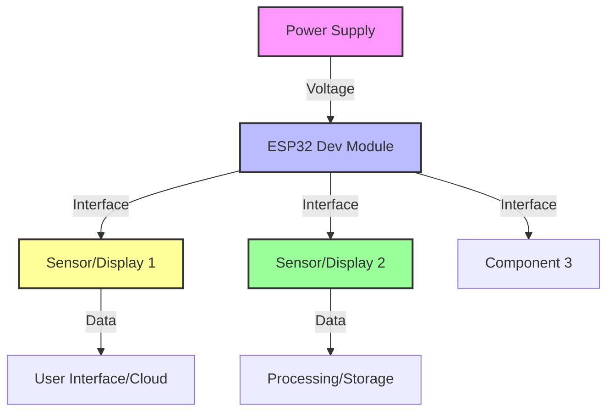
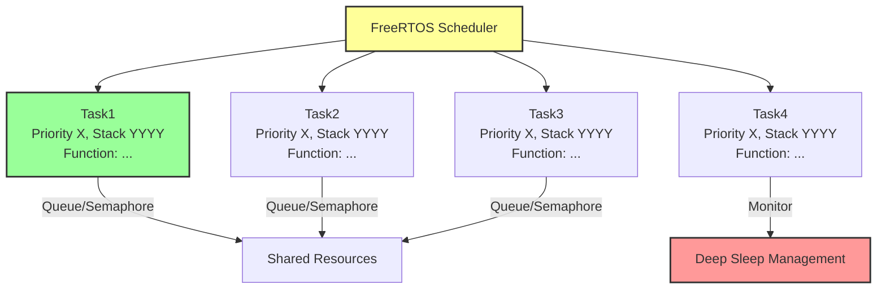
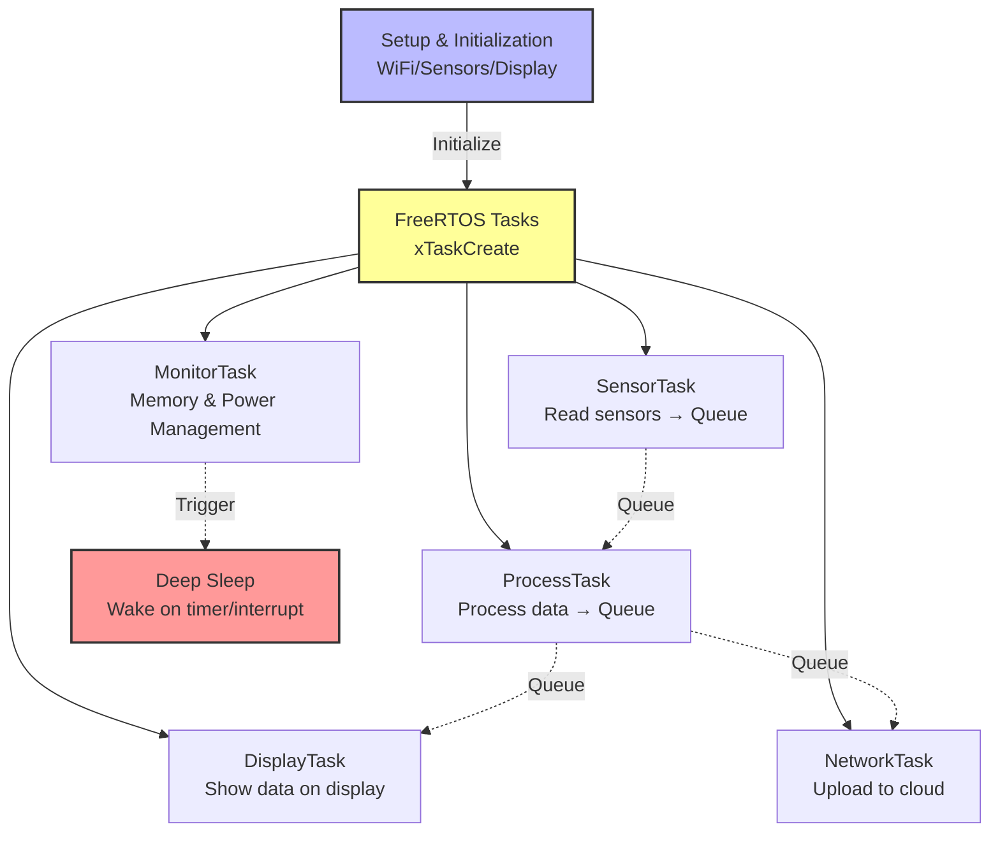

<h1 align="center">
🚀 [Nama Project Anda]<br>
    <sub>[Subtitle / Deskripsi Singkat Project]</sub>
</h1>

<p align="center">
  
</p>

<p align="center">
  <em>Deskripsi lengkap project Anda di sini. Jelaskan teknologi utama, fitur unggulan, dan keunggulan sistem yang dibangun.</em>
</p>
      
<p align="center">
  
  
  
  
  
  <a href="https://github.com/username/repo/blob/main/LICENSE">
    
  </a>
</p>

---

## 📋 Daftar Isi
- [Fitur Utama](#-fitur-utama)
- [Desain Lengkap](#-desain-lengkap)
  - [Desain Hardware](#-desain-hardware)
  - [Desain Software](#-desain-software)
- [Demo](#-demo-singkat)
- [Arsitektur Sistem](#-arsitektur-sistem)
- [Instalasi](#-instalasi)
- [Cara Menjalankan](#-cara-menjalankan)
- [Testing](#-testing)
- [Troubleshooting](#-troubleshooting)
- [Struktur Folder](#-struktur-folder)
- [Kontribusi](#-kontribusi)
- [Pengembang](#-pengembang)
- [Lisensi](#-lisensi)

---

## ✨ Fitur Utama

* 📡 [Fitur 1 - contoh: Monitoring sensor real-time]
* 🌡️ [Fitur 2 - contoh: Display OLED dengan animasi]
* ☁️ [Fitur 3 - contoh: Upload data ke cloud]
* 🚨 [Fitur 4 - contoh: Sistem alert LED & buzzer]
* 🧠 [Fitur 5 - contoh: FreeRTOS multitasking]
* 🔒 [Fitur 6 - contoh: Sinkronisasi aman dengan semaphore]
* 🔋 [Fitur 7 - contoh: Deep sleep untuk hemat daya]
* 🧪 [Fitur 8 - contoh: Simulasi di Wokwi/Proteus]

---

## 📐 Desain Lengkap

### 🔧 Desain Hardware

Project ini dirancang sebagai [jelaskan tujuan project]. Fokus pada [aspek penting seperti: low-power, portability, accuracy, dll].

#### Komponen Utama

| Komponen | Fungsi | Spesifikasi | Keterangan |
|----------|--------|-------------|------------|
| **ESP32 Dev Module** | Mikrokontroler utama | Dual-core 240MHz, 520KB SRAM, WiFi+BT | Handle tasks, networking, sleep management |
| **Sensor 1** | [Fungsi sensor] | GPIO X, Protocol Y | [Detail implementasi] |
| **Sensor 2** | [Fungsi sensor] | GPIO X, Protocol Y | [Detail implementasi] |
| **Display/Actuator** | [Fungsi] | Interface, Voltage | [Detail implementasi] |
| **Power Supply** | Sumber daya | Voltage, Capacity | [Battery/adapter details] |

#### Diagram Blok Hardware



#### 🔌 Wiring Diagram

<p align="center">
  <br/>
  <em>Diagram Pengkabelan Lengkap</em>
</p>

**Pin Configuration:**

| Komponen | ESP32 Pin | Catatan |
|----------|-----------|---------|
| Sensor 1 | GPIO XX | [Detail koneksi] |
| Sensor 2 | GPIO XX | [Detail koneksi] |
| LED | GPIO XX | + Resistor 220Ω |
| Buzzer | GPIO XX | Active buzzer |

⚠️ **Catatan Penting:**
- [Catatan khusus mengenai wiring]
- [Pull-up/pull-down requirements]
- [Voltage divider jika perlu]
- [Total power consumption: Active ~XXmA, Sleep <XmA]

---

### 💻 Desain Software

#### Teknologi yang Digunakan
- **Framework**: Arduino / ESP-IDF
- **RTOS**: FreeRTOS (built-in ESP32)
- **Libraries**: 
  - [Library 1 + versi]
  - [Library 2 + versi]
  - [Library 3 + versi]

#### Fitur Software Utama
- **Task Scheduling**: FreeRTOS tasks dengan prioritas berbeda
- **Networking**: WiFi/BLE untuk konektivitas
- **Data Storage**: SPIFFS/SD Card/Cloud integration
- **Power Management**: Deep sleep dengan wake-up triggers
- **Error Handling**: Watchdog timer & fallback mechanisms

#### Arsitektur FreeRTOS



**Tasks Description:**

| Task Name | Priority | Stack Size | Interval | Function |
|-----------|----------|------------|----------|----------|
| **Task1** | 1 | 8192 | 50ms | [Deskripsi fungsi] |
| **Task2** | 2 | 4096 | 1s | [Deskripsi fungsi] |
| **Task3** | 3 | 2048 | 10s | [Deskripsi fungsi] |
| **MonitorTask** | 4 | 2048 | 1s | Memory & sleep management |

---

## 📸 Demo Singkat

> [Deskripsi singkat tentang demo video/gif yang ditampilkan]

<p align="center">
  <br/>
  <em>Demo fitur utama project</em>
</p>

**Demo highlights:**
- [Highlight 1]
- [Highlight 2]
- [Highlight 3]

---

## 🏗️ Arsitektur Sistem

### Data Flow Diagram



---

## ⚙️ Instalasi

### Prerequisites
- **Hardware**: ESP32, komponen sesuai daftar
- **Software**: 
  - Arduino IDE / PlatformIO
  - ESP32 Board Package
  - Libraries yang dibutuhkan

### Langkah Instalasi

#### 1️⃣ Clone Repository
```bash
git clone https://github.com/username/project-name.git
cd project-name
```

#### 2️⃣ Setup Arduino IDE / PlatformIO

**Untuk Arduino IDE:**
```
1. Install ESP32 board: File → Preferences → Additional Boards Manager URLs
   https://dl.espressif.com/dl/package_esp32_index.json
2. Tools → Board → ESP32 Dev Module
3. Install libraries via Library Manager
```

**Untuk PlatformIO:**
```ini
[env:esp32dev]
platform = espressif32
board = esp32dev
framework = arduino

lib_deps =
  [library1@version]
  [library2@version]
  [library3@version]
```

#### 3️⃣ Konfigurasi

Edit file `config.h` atau di bagian awal kode:
```cpp
// WiFi Configuration
const char* WIFI_SSID = "Your_SSID";
const char* WIFI_PASSWORD = "Your_Password";

// API Keys (jika diperlukan)
const char* API_KEY = "Your_API_Key";

// Pin Configuration (sesuaikan jika perlu)
#define SENSOR_PIN 34
#define LED_PIN 2
```

#### 4️⃣ Upload Code
```bash
# PlatformIO
pio run -t upload

# Arduino IDE: Sketch → Upload
```

---

## 🚀 Cara Menjalankan

### Persiapan Hardware
1. Rakit komponen sesuai wiring diagram
2. Pastikan semua koneksi aman
3. Hubungkan power supply/battery

### First Run
1. Upload code ke ESP32
2. Buka Serial Monitor (115200 baud)
3. Tunggu WiFi connection berhasil
4. Monitor output untuk memastikan semua sensor bekerja

### Normal Operation
1. [Step-by-step penggunaan normal]
2. [Cara mengakses data/dashboard]
3. [Cara trigger events tertentu]

---

## 🧪 Testing

### Unit Testing
- **Test 1**: [Deskripsi test]
  - Expected: [Hasil yang diharapkan]
  - Command: `[command jika ada]`
  
- **Test 2**: [Deskripsi test]
  - Expected: [Hasil yang diharapkan]
  - Validation: [Cara validasi]

### Integration Testing
| Test Case | Procedure | Expected Result | Status |
|-----------|-----------|-----------------|--------|
| WiFi Connection | Power on → Check serial | Connected in <10s | ✅ |
| Sensor Reading | Monitor values | Accurate ±5% | ✅ |
| Data Upload | Check cloud dashboard | Data appears <5s | ✅ |
| Deep Sleep | Wait timeout | Current <1mA | ✅ |

---

## 🐞 Troubleshooting

### Masalah Umum

#### ❌ WiFi tidak connect
**Gejala**: Serial menampilkan "WiFi connection failed"
**Solusi**:
- Cek SSID dan password
- Pastikan router dalam jangkauan
- Restart ESP32 dan router
- Coba WiFi 2.4GHz (bukan 5GHz)

#### ❌ Sensor tidak terbaca
**Gejala**: Nilai sensor 0 atau error
**Solusi**:
- Verifikasi wiring
- Cek voltage sensor (3.3V/5V)
- Test sensor dengan sketch sederhana
- Periksa pull-up resistor jika diperlukan

#### ❌ Upload error
**Gejala**: "Failed to connect to ESP32"
**Solusi**:
- Tekan dan tahan tombol BOOT saat upload
- Cek driver USB-to-Serial (CH340/CP2102)
- Pilih port COM yang benar
- Kurangi upload speed

#### ❌ Program crash/restart
**Gejala**: WDT reset, brownout detector
**Solusi**:
- Naikkan stack size tasks
- Cek power supply (min 500mA)
- Tambahkan capacitor 100µF di VIN
- Review infinite loops di code

---

## 📁 Struktur Folder

```
project-name/
├── src/
│   ├── main.cpp              # Program utama
│   ├── config.h              # Konfigurasi
│   ├── sensors.h/cpp         # Sensor handlers
│   └── network.h/cpp         # Network functions
├── lib/                      # Custom libraries
├── assets/
│   ├── diagrams/             # Diagram dan gambar
│   ├── 3d-models/            # STL files untuk casing
│   └── datasheets/           # Datasheet komponen
├── test/
│   ├── sensor_test.ino       # Test individual sensor
│   ├── network_test.ino      # Test konektivitas
│   └── integration_test.ino  # Test sistem lengkap
├── docs/
│   ├── setup-guide.md        # Panduan setup detail
│   ├── api-reference.md      # API documentation
│   └── changelog.md          # Version history
├── platformio.ini            # PlatformIO config
├── README.md                 # File ini
└── LICENSE                   # Lisensi project
```

---

## 🔮 Roadmap & Future Improvements

- [ ] [Feature 1 yang akan ditambahkan]
- [ ] [Feature 2 yang akan ditambahkan]
- [ ] [Optimization yang direncanakan]
- [ ] [Integration dengan sistem lain]

---

## 🤝 Kontribusi

Kontribusi sangat diterima! Ikuti langkah berikut:

1. **Fork** repository ini
2. **Create** branch baru (`git checkout -b feature/AmazingFeature`)
3. **Commit** changes (`git commit -m 'Add some AmazingFeature'`)
4. **Push** ke branch (`git push origin feature/AmazingFeature`)
5. **Open** Pull Request

### Guidelines Kontribusi
- Tulis kode yang clean dan terdokumentasi
- Test semua changes sebelum PR
- Update README jika menambah fitur
- Follow existing code style

---

## 👨‍💻 Pengembang

**[Nama Anda]**  
- GitHub: [@username](https://github.com/username)
- Email: your.email@example.com
- LinkedIn: [Your Profile](https://linkedin.com/in/yourprofile)

### Acknowledgments
- [Credit ke library/tool yang digunakan]
- [Credit ke tutorial/inspirasi]
- [Credit ke kontributor lain]

---

## 📄 Lisensi

Project ini dilisensikan under MIT License - lihat file [LICENSE](LICENSE) untuk detail.

```
MIT License

Copyright (c) 2025 [Nama Anda]

Permission is hereby granted, free of charge, to any person obtaining a copy
of this software and associated documentation files...
```

---

## 📞 Support & Contact

Jika ada pertanyaan atau butuh bantuan:
- **GitHub Issues**: [Open an issue](https://github.com/username/repo/issues)
- **Email**: your.email@example.com
- **Discord/Telegram**: [Link jika ada]

---

<div align="center">

### 💡 Quote Inspirasi

> *"[Quote favorit atau motto project Anda]"*

---

**⭐ Star project ini jika bermanfaat!**

**🔔 Watch untuk update terbaru**

**🔱 Fork untuk develop sendiri**

<p><a href="#top">⬆️ Kembali ke atas</a></p>

</div>

---

## 📊 Statistics


**Made with ❤️ and ☕**
