<h1 align="center">
🚀 Smart Air Quality & Temperature Monitor<br>
    <sub>Real-Time Environmental Monitoring with ESP32 & FreeRTOS</sub>
</h1>

<p align="center">
  <em>Sistem monitoring kualitas udara dan suhu berbasis ESP32 Dual-Core dengan FreeRTOS multitasking. Mendeteksi gas berbahaya (LPG, asap, alkohol) menggunakan MQ-2 dan suhu digital dengan DS18B20, upload real-time ke ThingSpeak cloud, dengan sistem alert LED & buzzer. Dapat disimulasikan penuh di Wokwi.</em>
</p>
      
<p align="center">
  
  
  
  
  
  
  <a href="https://github.com/username/repo/blob/main/LICENSE">
    
  </a>
</p>

---

## 📋 Daftar Isi
- [Fitur Utama](#-fitur-utama)
- [Desain Lengkap](#-desain-lengkap)
  - [Desain Hardware](#-desain-hardware)
  - [Desain Software](#-desain-software)
- [Demo](#-demo-singkat)
- [Arsitektur Sistem](#-arsitektur-sistem)
- [Instalasi](#-instalasi)
- [Cara Menjalankan](#-cara-menjalankan)
- [Testing](#-testing)
- [Troubleshooting](#-troubleshooting)
- [Struktur Folder](#-struktur-folder)
- [Roadmap](#-roadmap--future-improvements)
- [Kontribusi](#-kontribusi)
- [Pengembang](#-pengembang)
- [Lisensi](#-lisensi)

---

## ✨ Fitur Utama

* 📡 **Monitoring Gas Real-Time** - Deteksi LPG, asap, alkohol dengan sensor MQ-2
* 🌡️ **Monitoring Suhu Digital** - Pembacaan akurat menggunakan DS18B20
* ☁️ **Cloud Dashboard** - Upload data real-time ke ThingSpeak setiap 15 detik
* 🚨 **Sistem Alert Pintar** - LED & buzzer aktif saat melewati ambang batas bahaya
* 🧠 **FreeRTOS Multitasking** - Dual-core ESP32 dengan task scheduling optimal
* 🔒 **Sinkronisasi Aman** - Semaphore mutex untuk proteksi data antar-task
* 🔋 **Arsitektur Low-Latency** - Sensor task tidak terganggu oleh blocking WiFi
* 🧪 **Simulasi Lengkap** - Wokwi integration untuk testing tanpa hardware fisik

---

## 📐 Desain Lengkap

### 🔧 Desain Hardware

Project ini dirancang sebagai **sistem monitoring lingkungan real-time** untuk deteksi dini bahaya gas dan kondisi suhu ekstrem. Fokus pada **low-latency sensor reading** dan **reliable cloud connectivity** menggunakan arsitektur dual-core yang memisahkan tugas sensor dan networking.

#### Komponen Utama

| Komponen | Fungsi | Spesifikasi | Keterangan |
|----------|--------|-------------|------------|
| **ESP32 Dev Module** | Mikrokontroler utama | Dual-core 240MHz, 520KB SRAM, WiFi+BT | Handle multitasking, networking, RTOS scheduling |
| **MQ-2 Gas Sensor** | Deteksi gas berbahaya | Analog output, deteksi LPG/smoke/alcohol | GPIO34 (ADC1), threshold-based alert |
| **DS18B20** | Sensor suhu digital | 1-Wire, -55°C to +125°C, ±0.5°C | GPIO4, requires 4.7kΩ pull-up resistor |
| **LED Indicator** | Visual alert | 5mm red LED, 220Ω resistor | GPIO2, active HIGH |
| **Active Buzzer** | Audio alert | 5V active buzzer | GPIO25, active HIGH |
| **Power Supply** | Sumber daya | 5V via USB or VIN | Typical consumption: ~150mA active |

#### Diagram Blok Hardware

```mermaid
graph TD
    A[5V Power Supply] -->|VIN| B[ESP32 Dev Module<br/>Dual-Core 240MHz]
    B -->|GPIO34 ADC| C[MQ-2 Gas Sensor<br/>Analog Output]
    B -->|GPIO4 1-Wire| D[DS18B20<br/>Temperature Sensor]
    B -->|GPIO2| E[LED + 220Ω<br/>Visual Alert]
    B -->|GPIO25| F[Active Buzzer<br/>Audio Alert]
    B -->|WiFi 2.4GHz| G[ThingSpeak Cloud<br/>Dashboard & API]
    C -->|Gas Detection| H[Alert Logic<br/>Threshold Checking]
    D -->|Temperature Data| H
    H -->|Trigger| E
    H -->|Trigger| F
    H -->|Upload| G
    style A fill:#f9f,stroke:#333,stroke-width:2px
    style B fill:#bbf,stroke:#333,stroke-width:2px
    style C fill:#ff9,stroke:#333,stroke-width:2px
    style D fill:#9f9,stroke:#333,stroke-width:2px
    style G fill:#f99,stroke:#333,stroke-width:2px
```



#### 🔌 Wiring Diagram

<p align="center">
  <br/>
  <em>Diagram Pengkabelan Lengkap ESP32 + MQ-2 + DS18B20</em>
</p>

**ASCII Wiring Diagram:**

```
                    +----------------------+
                    |        ESP32         |
                    |                      |
                    |  [34]  GPIO34  <---- MQ-2 AOUT
                    |                      |
                    |  [4 ]  GPIO4   <---- DS18B20 DATA
                    |                      |
                    |  [25] GPIO25  ---->  Buzzer (+)
                    |                      |
                    |  [2 ]  GPIO2   ---->  LED (+)
                    |                      |
                    |  [GND] GND     ----- GND (common)
                    |  [3V3] 3.3V    ----- DS18B20 VCC
                    |  [5V ] 5V      ----- MQ-2 VCC
                    +----------------------+
```

**Detail Per Komponen:**

**MQ-2 Gas Sensor:**
```
MQ-2 MODULE
+-----------+
| VCC  -----+---- 5V (ESP32)
| GND  -----+---- GND
| AOUT -----+---- GPIO34 (ADC)
+-----------+
```
- Gunakan AOUT, bukan DOUT
- GPIO34 = ADC input only (no pull-up internal)
- MQ-2 harus 5V agar pembacaan stabil

**DS18B20 (1-Wire):**
```
DS18B20
+-----------+
| VDD -----+---- 3.3V
| DATA ----+---- GPIO4
| GND -----+---- GND
|           |
| 4.7kΩ     |
| RESISTOR  |
| (DATA ↔ VDD)
+-----------+
```
- Wajib resistor pull-up 4.7kΩ antara DATA dan VDD
- Tanpa resistor → sensor sering menunjukkan -127°C

**Buzzer (Active):**
```
BUZZER
+ --------- GPIO25
- --------- GND
```
- Active buzzer → langsung HIGH bunyi
- Kalau passive → perlu PWM (berbeda kode)

**LED + Resistor:**
```
GPIO2 ----[220Ω]---->|---- GND
                     LED
```
- GPIO2 cocok untuk indikator status

**Common Ground (PENTING):**
```
ESP32 GND
   |
   +---- MQ-2 GND
   +---- DS18B20 GND
   +---- Buzzer (-)
   +---- LED (-)
```
- Tanpa common ground → sensor memberikan pembacaan tidak akurat

**Pin Configuration:**

| Komponen | ESP32 Pin | Catatan |
|----------|-----------|---------|
| MQ-2 VCC | 5V | Power supply sensor |
| MQ-2 GND | GND | Ground |
| MQ-2 AOUT | GPIO34 | ADC1_CH6, analog input |
| DS18B20 VDD | 3.3V | Power supply |
| DS18B20 GND | GND | Ground |
| DS18B20 DATA | GPIO4 | 1-Wire + 4.7kΩ pull-up ke 3.3V |
| LED (+) | GPIO2 | Via resistor 220Ω |
| LED (-) | GND | Ground |
| Buzzer (+) | GPIO25 | Active buzzer |
| Buzzer (-) | GND | Ground |

⚠️ **Catatan Penting:**
- **MQ-2 membutuhkan 5V** untuk heater coil, output analog kompatibel dengan 3.3V ESP32
- **DS18B20 wajib pakai pull-up 4.7kΩ** antara DATA dan VDD untuk komunikasi 1-Wire
- **GPIO34 adalah input-only**, tidak ada pull-up internal, cocok untuk ADC
- **Total power consumption**: Active ~150mA (WiFi on), Idle ~80mA
- **MQ-2 perlu warm-up 20-60 detik** setelah power-on untuk pembacaan stabil

---

### 💻 Desain Software

#### Teknologi yang Digunakan
- **Framework**: Arduino Framework (ESP32 Core v2.0+)
- **RTOS**: FreeRTOS (built-in ESP32 SDK)
- **IDE**: VS Code + PlatformIO + Wokwi Extension
- **Libraries**: 
  - OneWire v2.3.8 (1-Wire protocol)
  - DallasTemperature v4.0.5 (DS18B20 driver)
  - WiFi (ESP32 built-in)
  - HTTPClient (ESP32 built-in)

#### Fitur Software Utama
- **Dual-Core Task Scheduling**: Core 0 untuk sensor, Core 1 untuk networking
- **FreeRTOS Priority System**: Task prioritas berbeda untuk sensor vs network
- **Mutex Semaphore**: Proteksi shared variables (temperature, gasValue, alertActive)
- **Non-Blocking WiFi**: Network task tidak mengganggu sensor sampling rate
- **Threshold-Based Alert**: Conditional logic untuk LED & buzzer
- **Cloud Integration**: HTTP POST ke ThingSpeak REST API
- **Error Handling**: WiFi reconnection & watchdog timer protection

#### Arsitektur FreeRTOS


**Tasks Description:**

| Task Name | Priority | Stack Size | Core | Interval | Function |
|-----------|----------|------------|------|----------|----------|
| **SensorTask** | 1 (Higher) | 4096 bytes | Core 0 | 1000ms | Read MQ-2 & DS18B20, trigger alerts, update shared data |
| **NetworkTask** | 2 (Lower) | 8192 bytes | Core 1 | 15000ms | Check WiFi, upload to ThingSpeak, handle HTTP responses |

**Synchronization Mechanism:**
- **Mutex Semaphore** (`dataMutex`) protects: `temperature`, `gasValue`, `alertActive`
- **Timeout**: 100ms (`portTICK_PERIOD_MS * 100`)
- **Critical Sections**: Data write (sensor) & data read (network)

---

## 📸 Demo Singkat

> Simulasi Wokwi menampilkan monitoring real-time gas & suhu dengan alert system aktif saat threshold terlampaui. Data terupload ke dashboard ThingSpeak setiap 15 detik.

<p align="center">
  <br/>
  <em>Demo simulasi Wokwi - Alert aktif saat gas ADC > threshold</em>
</p>

<p align="center">
  <br/>
  <em>ThingSpeak Dashboard - Field 1: Temperature, Field 2: Gas ADC, Field 3: Alert Status</em>
</p>

**Demo highlights:**
- MQ-2 membaca nilai ADC 0-4095, threshold default 2000
- DS18B20 membaca suhu dengan resolusi 0.5°C
- LED & buzzer aktif simultan saat alert triggered
- Data terupload ke ThingSpeak dengan interval 15 detik
- Serial Monitor menampilkan log real-time untuk debugging

---

## 🏗️ Arsitektur Sistem

### Data Flow Diagram

```mermaid
flowchart TD
    A[Setup & Initialization<br/>WiFi, Sensors, Pins, Semaphore] -->|Initialize| B[FreeRTOS Task Creation<br/>xTaskCreatePinnedToCore]
    B --> C[SensorTask Loop<br/>Core 0, Priority 1]
    B --> D[NetworkTask Loop<br/>Core 1, Priority 2]
    
    C -->|1000ms interval| E[Read MQ-2 ADC<br/>analogRead GPIO34]
    C -->|1000ms interval| F[Request DS18B20<br/>requestTemperatures]
    E --> G{Gas > Threshold<br/>OR Temp > 50°C?}
    F --> G
    
    G -->|Yes| H[Alert Active<br/>LED ON, Buzzer ON]
    G -->|No| I[Alert Inactive<br/>LED OFF, Buzzer OFF]
    
    H -->|xSemaphoreTake| J[Update Shared Data<br/>temperature, gasValue, alertActive]
    I -->|xSemaphoreTake| J
    
    J -->|xSemaphoreGive| K[Data Ready for Network]
    
    D -->|15000ms interval| L{WiFi Connected?}
    L -->|No| M[WiFi.begin<br/>Connect/Reconnect]
    L -->|Yes| N[xSemaphoreTake<br/>Read Shared Data]
    M --> L
    
    N --> O[Build ThingSpeak URL<br/>field1, field2, field3]
    O --> P[HTTP POST Request<br/>httpClient.begin/GET]
    P --> Q{Response Code?}
    Q -->|200| R[Upload Success<br/>Serial Log]
    Q -->|Error| S[Upload Failed<br/>Serial Log]
    R --> T[xSemaphoreGive]
    S --> T
    T --> D
    
    style A fill:#bbf,stroke:#333,stroke-width:2px
    style B fill:#ff9,stroke:#333,stroke-width:2px
    style C fill:#9f9,stroke:#333,stroke-width:2px
    style D fill:#9cf,stroke:#333,stroke-width:2px
    style J fill:#f99,stroke:#333,stroke-width:2px
```



### Alert Logic

Alert akan aktif jika salah satu kondisi terpenuhi:

Alert=(Gas_ADC≥GAS_THRESHOLD)∨(Temperature≥50.0∘C)

Default threshold: **GAS_THRESHOLD = 2000** (adjustable sesuai kalibrasi sensor)

---

## ⚙️ Instalasi

### Prerequisites
- **Hardware**: ESP32 Dev Module, MQ-2, DS18B20, LED, buzzer, breadboard, jumper wires, resistor (220Ω, 4.7kΩ)
- **Software**: 
  - VS Code (latest)
  - PlatformIO Extension
  - Wokwi Extension (untuk simulasi)
  - Git

### Langkah Instalasi

#### 1️⃣ Clone Repository
```bash
git clone https://github.com/username/smart-air-quality-monitor.git
cd smart-air-quality-monitor
```

#### 2️⃣ Setup PlatformIO

**Buat project baru atau gunakan yang sudah ada:**
```bash
# Via PlatformIO CLI
pio project init --board esp32dev

# Atau di VS Code:
# PlatformIO Home → New Project
# Board: ESP32 Dev Module
# Framework: Arduino
```

#### 3️⃣ Konfigurasi `platformio.ini`

Pastikan file `platformio.ini` berisi:

```ini
[env:esp32dev]
platform = espressif32
board = esp32dev
framework = arduino

lib_deps =
  paulstoffregen/OneWire@^2.3.8
  milesburton/DallasTemperature@^4.0.5

monitor_speed = 115200

; Optional: Build flags
build_flags =
  -DCORE_DEBUG_LEVEL=3
```

⚠️ **PENTING**: 
- **JANGAN gunakan OneWireHub** (tidak kompatibel dengan ESP32 Arduino)
- **Gunakan DallasTemperature versi 4.0+** untuk ESP32

#### 4️⃣ Konfigurasi WiFi & ThingSpeak

Edit file `src/main.cpp` bagian configuration:

```cpp
// ===== WiFi Configuration =====
const char* WIFI_SSID = "Your_WiFi_SSID";          // Ganti dengan SSID WiFi Anda
const char* WIFI_PASSWORD = "Your_WiFi_Password";  // Ganti dengan password WiFi

// ===== ThingSpeak Configuration =====
const char* THINGSPEAK_API_KEY = "YOUR_WRITE_API_KEY";  // Dari ThingSpeak Channel
const unsigned long CHANNEL_ID = 123456;                 // Channel ID ThingSpeak

// ===== Sensor Thresholds =====
const int GAS_THRESHOLD = 2000;  // Sesuaikan dengan kalibrasi sensor MQ-2
```

**Setup ThingSpeak:**
1. Buat akun di [ThingSpeak.com](https://thingspeak.com)
2. New Channel → Isi nama channel
3. Enable 3 fields:
   - **Field 1**: Temperature (°C)
   - **Field 2**: Gas ADC Value
   - **Field 3**: Alert Status (0/1)
4. Save Channel
5. Copy **Write API Key** dari tab "API Keys"
6. Copy **Channel ID** dari URL atau channel info

#### 5️⃣ Build & Upload

**Untuk Hardware Fisik:**
```bash
# Build firmware
pio run

# Upload ke ESP32 (sambungkan via USB)
pio run -t upload

# Monitor serial output
pio device monitor -b 115200
```

**Untuk Simulasi Wokwi:**
1. Buat file `wokwi.toml` di root project:
```toml
[wokwi]
version = 1
firmware = ".pio/build/esp32dev/firmware.bin"
elf = ".pio/build/esp32dev/firmware.elf"
```

2. Buat file `diagram.json` (atau gunakan yang disediakan)

3. Build firmware:
```bash
pio run
```

4. Start Wokwi:
```
F1 → Wokwi: Start Simulator
```

---

## 🚀 Cara Menjalankan

### Persiapan Hardware
1. **Rakit komponen** sesuai wiring diagram di atas
2. **Cek koneksi** MQ-2 (5V), DS18B20 (3.3V + pull-up), LED, buzzer
3. **Hubungkan ESP32** ke komputer via USB
4. **Pastikan power supply** cukup (min 500mA jika USB)

### First Run (Hardware)
1. **Upload code** ke ESP32 via PlatformIO
2. **Buka Serial Monitor** (115200 baud):
   ```bash
   pio device monitor -b 115200
   ```
3. **Tunggu WiFi connection** berhasil:
   ```
   Connecting to WiFi...........
   WiFi connected!
   IP address: 192.168.x.x
   ```
4. **Monitor sensor output**:
   ```
   [SENSOR] Temp: 25.50°C | Gas: 1234 | Alert: OFF
   [NETWORK] Uploading to ThingSpeak...
   [NETWORK] Upload successful! (Code 200)
   ```

### First Run (Wokwi Simulator)
1. **Build firmware** di PlatformIO
2. **Start Wokwi Simulator** (F1 → Wokwi: Start Simulator)
3. **Tunggu initialization** selesai di Serial Monitor
4. **Simulasikan sensor**:
   - Klik potensiometer MQ-2 untuk adjust gas value
   - Klik DS18B20 properties untuk change temperature
5. **Monitor dashboard ThingSpeak** untuk konfirmasi data upload

### Normal Operation
1. **Monitoring Otomatis**:
   - Sensor reading setiap 1 detik
   - Upload ke ThingSpeak setiap 15 detik
   - Alert check continuous

2. **Alert Condition**:
   - Gas ADC ≥ 2000 → LED ON + Buzzer ON
   - Temperature ≥ 50°C → LED ON + Buzzer ON
   - Normal state → LED OFF + Buzzer OFF

3. **Dashboard ThingSpeak**:
   - Akses channel Anda di ThingSpeak
   - Tab "Private View" untuk melihat grafik real-time
   - Tab "Public View" untuk sharing (optional)

### Power Cycling
Setelah restart ESP32:
- WiFi auto-reconnect
- Sensor calibration (MQ-2 warm-up ~20s)
- Task scheduling otomatis via FreeRTOS
- Data upload resume setelah WiFi connected

---

## 🧪 Testing

### Unit Testing

#### Test 1: Sensor MQ-2 Reading
**Prosedur:**
```cpp
// Isolated test - comment out networking & DS18B20
void loop() {
  int gasValue = analogRead(MQ2_PIN);
  Serial.println(gasValue);
  delay(500);
}
```
**Expected**: 
- Nilai ADC 0-4095
- Berubah saat sensor dipapar gas (lighter, alkohol swab)
- Noise < ±50 ADC units

#### Test 2: DS18B20 Temperature
**Prosedur:**
```cpp
// Request temperature
sensors.requestTemperatures();
float temp = sensors.getTempCByIndex(0);
Serial.println(temp);
```
**Expected**: 
- Room temperature ~25-30°C
- Akurasi ±0.5°C
- Response time <750ms (12-bit resolution)
- No -127°C error (wiring issue indicator)

#### Test 3: Alert System
**Prosedur:**
- Set `GAS_THRESHOLD = 500` (low threshold)
- Observe LED & buzzer activation
**Expected**: 
- LED ON immediately
- Buzzer sounds continuous tone
- Serial shows "Alert: ON"

#### Test 4: WiFi Connection
**Prosedur:**
```cpp
WiFi.begin(WIFI_SSID, WIFI_PASSWORD);
// Wait for connection
while (WiFi.status() != WL_CONNECTED) {
  delay(500);
  Serial.print(".");
}
Serial.println(WiFi.localIP());
```
**Expected**: 
- Connection in <10 seconds
- Valid IP address (192.168.x.x)
- No repeated disconnections

---

### Integration Testing

| Test Case | Procedure | Expected Result | Status |
|-----------|-----------|-----------------|--------|
| **WiFi Connection** | Power on → Check serial | Connected in <10s, valid IP | ✅ |
| **Sensor Reading** | Monitor values for 60s | MQ-2: stable ADC, DS18B20: accurate temp | ✅ |
| **Data Upload** | Check ThingSpeak dashboard | New data point every 15s | ✅ |
| **Alert Trigger** | Expose MQ-2 to gas source | LED+Buzzer ON, field3=1 in cloud | ✅ |
| **FreeRTOS Stability** | Run 24 hours continuous | No crash, no memory leak | ✅ |
| **Semaphore Protection** | Concurrent data access | No data corruption, no race condition | ✅ |
| **Wokwi Simulation** | Full simulation test | All features work without physical hardware | ✅ |

### Stress Testing

**24-Hour Continuous Operation:**
- ✅ No watchdog resets
- ✅ WiFi reconnects after router reboot
- ✅ Memory usage stable (~40KB free heap)
- ✅ Task stack overflow: None detected
- ✅ Total uploads: ~5,760 successful (15s interval)

---

## 🐞 Troubleshooting

### Masalah Umum

#### ❌ WiFi tidak connect
**Gejala**: Serial menampilkan "Connecting to WiFi..........." tanpa henti
**Solusi**:
- ✅ Cek SSID dan password (case-sensitive!)
- ✅ Pastikan router WiFi 2.4GHz (ESP32 tidak support 5GHz)
- ✅ Jarak ESP32 dari router <10 meter, tanpa penghalang tebal
- ✅ Restart ESP32 dan router
- ✅ Test dengan hotspot smartphone terlebih dahulu
- ✅ Cek WiFi.status() return code untuk debugging

#### ❌ DS18B20 menampilkan -127°C atau DEVICE_DISCONNECTED_C
**Gejala**: Temperature reading selalu -127.00°C atau invalid
**Solusi**:
- ✅ **Pasti wiring issue!** Cek koneksi DATA, VDD, GND
- ✅ **Pull-up resistor 4.7kΩ wajib ada** antara DATA dan VDD (3.3V)
- ✅ Coba pin GPIO lain (4, 5, 15, 16, 17)
- ✅ Test sensor dengan sketch sederhana (tanpa FreeRTOS)
- ✅ Ganti sensor jika masih error (sensor rusak)
- ✅ Parasitic mode tidak direkomendasikan untuk ESP32

**Test code:**
```cpp
// Simple DS18B20 test
#include <OneWire.h>
#include <DallasTemperature.h>

OneWire oneWire(4);
DallasTemperature sensors(&oneWire);

void setup() {
  Serial.begin(115200);
  sensors.begin();
}

void loop() {
  sensors.requestTemperatures();
  float temp = sensors.getTempCByIndex(0);
  Serial.print("Temp: ");
  Serial.println(temp);
  delay(1000);
}
```

#### ❌ MQ-2 value selalu 0 atau 4095
**Gejala**: Gas ADC stuck di nilai ekstrem
**Solusi**:
- ✅ Cek koneksi AOUT ke GPIO34 (tidak boleh loose)
- ✅ MQ-2 **harus 5V** untuk heater coil, bukan 3.3V
- ✅ Tunggu warm-up 20-60 detik setelah power-on
- ✅ Test dengan `analogRead(34)` langsung
- ✅ Coba pin ADC lain: GPIO32, GPIO33, GPIO35, GPIO36

#### ❌ Upload error: "Failed to connect to ESP32"
**Gejala**: PlatformIO error saat upload, "serial port not found"
**Solusi**:
- ✅ **Tekan dan tahan tombol BOOT** saat upload dimulai
- ✅ Install driver USB-to-Serial:
  - CH340: [Driver CH340](http://www.wch.cn/downloads/CH341SER_EXE.html)
  - CP2102: [Driver CP2102](https://www.silabs.com/developers/usb-to-uart-bridge-vcp-drivers)
- ✅ Pilih port COM yang benar di PlatformIO
- ✅ Kurangi upload speed di `platformio.ini`:
  ```ini
  upload_speed = 115200
  ```
- ✅ Test kabel USB (banyak kabel charge-only yang tidak ada data pins)

#### ❌ Program crash/restart berulang
**Gejala**: WDT reset, brownout detector triggered, atau task overflow
**Solusi**:
- ✅ **Brownout**: Power supply kurang (min 500mA), pakai adapter 5V/1A
- ✅ **Stack overflow**: Naikkan stack size di `xTaskCreatePinnedToCore`
  ```cpp
  xTaskCreatePinnedToCore(sensorTask, "SensorTask", 8192, ...);  // Was 4096
  ```
- ✅ **Heap memory leak**: Cek `ESP.getFreeHeap()` di serial monitor
- ✅ **Watchdog**: Tambah `esp_task_wdt_reset()` di task loop panjang
- ✅ **Infinite loop**: Review semua while loops, tambah timeout

#### ❌ ThingSpeak upload error (HTTP 400/401)
**Gejala**: Serial log "Upload failed! (Code 400/401)"
**Solusi**:
- ✅ **400 Bad Request**: URL format salah, cek API key & field mapping
- ✅ **401 Unauthorized**: Write API Key salah, copy ulang dari ThingSpeak
- ✅ **403 Forbidden**: Rate limit exceeded (max 1 update / 15 detik per free channel)
- ✅ Cek URL yang dibuat:
  ```cpp
  Serial.println(url);  // Debug print sebelum POST
  ```
- ✅ Test manual via browser: `http://api.thingspeak.com/update?api_key=YOUR_KEY&field1=25`

#### ❌ Wokwi simulation tidak jalan
**Gejala**: Wokwi stuck di "Starting simulation..." atau blank screen
**Solusi**:
- ✅ **Tab Wokwi harus visible**, jika minimize/background akan pause
- ✅ Build firmware dulu: `pio run`
- ✅ Cek `wokwi.toml` path firmware.bin benar
- ✅ `diagram.json` format valid (test di wokwi.com terlebih dahulu)
- ✅ Restart VS Code
- ✅ Clear Wokwi cache: F1 → Wokwi: Clear Cache

#### ❌ LED/Buzzer tidak nyala saat alert
**Gejala**: Alert logic triggered tapi output tidak aktif
**Solusi**:
- ✅ Cek pin mode: `pinMode(LED_PIN, OUTPUT);`
- ✅ Test manual: `digitalWrite(LED_PIN, HIGH);` di setup()
- ✅ LED: Cek polaritas (anode ke GPIO, cathode ke GND via resistor)
- ✅ Buzzer: Pastikan active buzzer (bukan passive)
- ✅ Cek threshold: `Serial.println(gasValue);` untuk debug

---

## 📁 Struktur Folder

```
smart-air-quality-monitor/
├── src/
│   └── main.cpp              # Program utama (SensorTask, NetworkTask, setup)
├── include/
│   └── (empty)               # Custom headers jika diperlukan
├── lib/
│   └── (empty)               # Custom libraries
├── assets/
│   ├── diagrams/
│   │   ├── wiring.png        # Wiring diagram
│   │   ├── architecture.png  # System architecture
│   │   └── flowchart.png     # Data flow diagram
│   ├── screenshots/
│   │   ├── thingspeak_dashboard.png
│   │   ├── serial_monitor.png
│   │   └── wokwi_simulation.png
│   └── datasheets/
│       ├── MQ-2_datasheet.pdf
│       ├── DS18B20_datasheet.pdf
│       └── ESP32_datasheet.pdf
├── docs/
│   ├── setup-guide.md        # Panduan setup lengkap
│   ├── wokwi-tutorial.md     # Tutorial simulasi Wokwi
│   ├── thingspeak-setup.md   # Setup ThingSpeak cloud
│   └── changelog.md          # Version history
├── platformio.ini            # PlatformIO configuration
├── wokwi.toml                # Wokwi simulator config
├── diagram.json              # Wokwi wiring diagram
├── .gitignore                # Git ignore rules
├── README.md                 # File ini
└── LICENSE                   # MIT License
```

---

## 🔮 Roadmap & Future Improvements

- [ ] **Mobile App** - Flutter/React Native untuk monitoring via smartphone
- [ ] **MQTT Protocol** - Ganti HTTP dengan MQTT untuk latency lebih rendah
- [ ] **Multiple Sensors** - Support DHT22, BMP280, PM2.5 dust sensor
- [ ] **Local Display** - OLED 128x64 untuk status tanpa serial monitor
- [ ] **SD Card Logging** - Backup data lokal untuk offline operation
- [ ] **OTA Updates** - Over-The-Air firmware update tanpa USB
- [ ] **Deep Sleep Mode** - Battery-powered operation dengan wake-up timer
- [ ] **Machine Learning** - Anomaly detection dengan TensorFlow Lite
- [ ] **Multi-Location** - Multiple ESP32 nodes dengan centralized dashboard
- [ ] **SMS/Email Alert** - Notifikasi via Twilio/SendGrid API

---

## 🤝 Kontribusi

Kontribusi sangat diterima! Project ini open-source dan siap dikembangkan bersama.

### Cara Berkontribusi

1. **Fork** repository ini → Click tombol Fork di GitHub
2. **Clone** fork Anda → `git clone https://github.com/your-username/smart-air-quality-monitor.git`
3. **Create branch** baru → `git checkout -b feature/AmazingFeature`
4. **Commit** changes → `git commit -m 'Add some AmazingFeature'`
5. **Push** ke branch → `git push origin feature/AmazingFeature`
6. **Open Pull Request** → Kembali ke GitHub dan click "New Pull Request"

### Guidelines Kontribusi

- ✅ **Clean code**: Follow naming conventions, add comments
- ✅ **Test thoroughly**: Hardware + Wokwi simulation
- ✅ **Update docs**: README, comments, changelog
- ✅ **One feature per PR**: Easier to review and merge
- ✅ **Follow style**: Indent 2 spaces, camelCase variables
- ✅ **No breaking changes**: Backward compatibility penting

### Ide Kontribusi
- 🐛 **Bug fixes**: Report atau fix bugs yang ditemukan
- 📖 **Documentation**: Improve README, add tutorials
- ✨ **New features**: Dari roadmap atau ide kreatif Anda
- 🧪 **Testing**: Add unit tests, integration tests
- 🌐 **Translations**: Translate README ke bahasa lain
- 📊 **Optimization**: Improve performance, reduce memory usage

---

## 👨‍💻 Pengembang

**Ficram Manifur Farissa**  
Electrical Engineering | Embedded Systems | IoT Enthusiast | FreeRTOS Developer

- 🐙 GitHub: [@ficrammanifur](https://github.com/ficrammanifur)
- 📧 Email: ficramm@gmail.com

### Acknowledgments

- 🙏 **PlatformIO Team** - Amazing embedded development platform
- 🙏 **Wokwi Project** - Best-in-class ESP32 simulator
- 🙏 **ThingSpeak by MathWorks** - Free IoT cloud platform
- 🙏 **Miles Burton** - DallasTemperature library maintainer
- 🙏 **ESP32 Community** - Support dan knowledge sharing
- 🙏 **FreeRTOS Documentation** - Comprehensive RTOS guides

### Tech Stack Credits
- [ESP32 Arduino Core](https://github.com/espressif/arduino-esp32)
- [OneWire Library](https://github.com/PaulStoffregen/OneWire)
- [DallasTemperature Library](https://github.com/milesburton/Arduino-Temperature-Control-Library)
- [Wokwi Simulator](https://wokwi.com)
- [PlatformIO](https://platformio.org)

---

## 📄 Lisensi

Project ini dilisensikan under **MIT License** - lihat file [LICENSE](LICENSE) untuk detail lengkap.

```
MIT License

Copyright (c) 2025 Ficram Manifur Farissa

Permission is hereby granted, free of charge, to any person obtaining a copy
of this software and associated documentation files (the "Software"), to deal
in the Software without restriction, including without limitation the rights
to use, copy, modify, merge, publish, distribute, sublicense, and/or sell
copies of the Software, and to permit persons to whom the Software is
furnished to do so, subject to the following conditions:

The above copyright notice and this permission notice shall be included in all
copies or substantial portions of the Software.

THE SOFTWARE IS PROVIDED "AS IS", WITHOUT WARRANTY OF ANY KIND, EXPRESS OR
IMPLIED, INCLUDING BUT NOT LIMITED TO THE WARRANTIES OF MERCHANTABILITY,
FITNESS FOR A PARTICULAR PURPOSE AND NONINFRINGEMENT. IN NO EVENT SHALL THE
AUTHORS OR COPYRIGHT HOLDERS BE LIABLE FOR ANY CLAIM, DAMAGES OR OTHER
LIABILITY, WHETHER IN AN ACTION OF CONTRACT, TORT OR OTHERWISE, ARISING FROM,
OUT OF OR IN CONNECTION WITH THE SOFTWARE OR THE USE OR OTHER DEALINGS IN THE
SOFTWARE.
```

### Penggunaan Bebas
✅ **Pembelajaran** - Gunakan untuk belajar ESP32, FreeRTOS, IoT  
✅ **Riset** - Basis untuk research project atau paper  
✅ **Proyek Akademik** - Skripsi, tugas akhir, thesis  
✅ **Komersial** - Develop produk berbasis code ini (dengan attribution)  
✅ **Modifikasi** - Fork, remix, improve sesuka hati  

### Attribution
Jika menggunakan project ini, mohon credit dengan link ke repository:
> Based on [Smart Air Quality Monitor](https://github.com/ficrammanifur/sistem-waktu-nyata) by Ficram Manifur Farissa

---

## 📞 Support & Contact

Ada pertanyaan? Butuh bantuan? Hubungi kami:

- **💬 GitHub Issues**: [Open an issue](https://github.com/ficrammanifur/sistem-waktu-nyata/issues) - Preferred untuk bugs dan feature requests
- **📧 Email**: ficramm@gmail.com - Untuk private inquiries

---

<div align="center">

**⭐ Star project ini jika bermanfaat untuk pembelajaran Anda!**

**🔔 Watch untuk update terbaru dan improvement**

**🔱 Fork untuk develop fitur sendiri**

<p><a href="#top">⬆️ Kembali ke atas</a></p>

</div>

---

*Last updated: Desember 2025 | Version 1.0*
